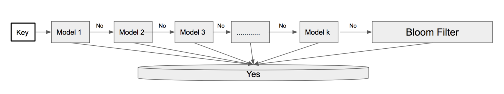

# DeepBloom
We introduce a new learned-index bloom filter, which we call DeepBloom, for determining probabilistically whether a given record is an element of a set. This structure is an extension (generalization) of a learned-index bloom filter proposed by Kraska et. al (2017), and is designed for read-heavy workloads. More details on our approach and results can be found in our [writeup](https://www.overleaf.com/read/pmmfyqwrtspn#/64016477/).

This repository contains implementations, tests, and other utilities for DeepBloom and the original Kraska et. al bloom filter.

